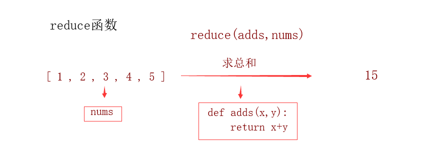

##高阶函数-map、filter、reduce


```python
from functools import reduce


def main():
    list1=list(map(lambda x:x**2,range(1,10)))
    list2=list(filter(lambda x:x>5,[2,10,7,6,4,12]))
    list3=reduce(lambda x,y:x+y,[1,2,3,4,5,6])#需要内置库
    print(list1)
    print(list2)
    print(list3)


if __name__=='__main__':
    main()
```

输出结果：
```
[1, 4, 9, 16, 25, 36, 49, 64, 81]
[10, 7, 6, 12]
31
```
map函数接收的是两个参数，一个函数，一个序列，其功能是将序列中的值处理再依次返回至列表内。其返回值为一个迭代器对象--》
例如：<map object at 0x00000214EEF40BA8>。其用法如图：


filter函数也是接收一个函数和一个序列的高阶函数，其主要功能是过滤。其返回值也是迭代器对象，
例如：<filter object at 0x000002042D25EA90>，其图示如下：


reduce函数也是一个参数为函数，一个为可迭代对象的高阶函数，其返回值为一个值而不是迭代器对象，故其常用与叠加、叠乘等，图示例如下：

